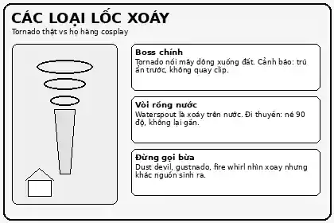

# Các loại lốc xoáy 🌪️

## Điều hướng

- Breadcrumb: [Child Knowledge Tree](../../../../README.md) > [Cây kiến thức](../../../README.md) > [Tự nhiên](../../README.md) > [Thời tiết](../README.md) > **Các loại lốc xoáy**
- Cha: [Thời tiết](../README.md)
- Cùng cấp: chưa có
- Con: chưa có
- Metadata: [metadata.json](../../../../metadata.json)

## Mở màn truyện tranh

Bé Não Cá Vàng thấy một cái cột xoay trên mạng liền hét: “Tornado kìa!”. Thầy Cú Đêm bình tĩnh đẩy kính: “Khoan, cái gì xoay chưa chắc là tornado. Có đứa là boss dông xoay, có đứa chỉ là bé bụi nghịch cát, có đứa là lửa cosplay ninja.”

## 5 ý cốt lõi nhất

### 1. Tornado là “boss chính” của nhà xoáy

**Tornado** là cột không khí xoay dữ dội, hẹp, kéo dài từ mây dông xuống mặt đất. Nếu phễu chưa chạm đất thì thường gọi là **funnel cloud**; khi có tiếp xúc mặt đất hoặc bụi/mảnh vỡ xác nhận thì mới là tornado. Nói đời thường: mây dông thò “ống hút khổng lồ” xuống mặt đất, mái tôn bắt đầu xin nghỉ phép không lương.

**Áp dụng thực tế:** nghe cảnh báo tornado thì ưu tiên trú ẩn ngay ở tầng thấp, phòng trong nhà, tránh kính. Đừng đứng quay video để “làm content”; content sống sót vẫn hay hơn.

### 2. Tornado không chỉ có một kiểu

Tornado có thể đến từ **supercell thunderstorm** hoặc các dông không phải supercell. Supercell thường nguy hiểm hơn vì có dòng khí đi lên xoay; QLCS tornado đến từ dải dông mạnh, thường ngắn hơn/yếu hơn trung bình nhưng khó chịu vì hay xảy ra đêm hoặc sáng sớm.

**Áp dụng thực tế:** nếu vùng bạn ở có dông mạnh ban đêm, bật cảnh báo thời tiết. Đừng đợi nhìn thấy phễu mới chạy, vì lúc đó phễu có thể đã nhìn thấy bạn trước.

### 3. Waterspout / vòi rồng nước là “xoáy đi bơi”

**Waterspout** là xoáy trên mặt nước. Có loại **tornadic waterspout** là tornado hình thành trên nước hoặc đi từ đất ra nước; có loại **fair-weather waterspout** thường hình thành trong thời tiết tương đối yên hơn và mọc từ mặt nước lên.

**Áp dụng thực tế:** đang đi thuyền mà thấy vòi rồng nước thì đi lệch khoảng 90 độ so với hướng di chuyển của nó, không lái lại gần để “xem cho rõ”.

### 4. Dust devil và gustnado nhìn giống tornado nhưng không phải tornado

**Dust devil** thường sinh ra khi mặt đất nóng mạnh, trời quang, gió nhẹ; nó nhỏ hơn tornado nhưng vẫn có thể hất bụi, đồ nhẹ hoặc làm hỏng lều bạt. **Gustnado** là xoáy nhỏ ở luồng gió thoát ra từ dông, không nối với xoáy ở đáy mây nên không được tính là tornado.

**Áp dụng thực tế:** ở bãi đất trống, công trường, sân thể thao, hãy giữ đồ nhẹ, che mắt, tránh lều bạt hoặc vật có thể bị cuốn.

### 5. Fire whirl / lốc xoáy lửa là “lửa xoay tăng động”

**Fire whirl** sinh ra trong đám cháy khi nhiệt bốc lên mạnh gặp gió rối tạo xoáy. Nó thường không phải tornado đúng nghĩa, nhưng nguy hiểm vì có thể mang lửa, tro, tàn cháy và làm đám cháy lan nhanh hơn.

**Áp dụng thực tế:** gặp cháy lớn ngoài trời thì rời khỏi vùng cháy, tránh cuối hướng gió, nghe hướng dẫn sơ tán. Đừng xem lốc lửa như pháo hoa miễn phí.

## 8 ý phổ biến còn lại

### 1. Supercell tornado khác gì tornado thường?

Supercell tornado là tornado sinh ra từ **supercell**, tức dông có dòng khí đi lên xoay. Đây là nhóm thường được nhắc đến khi nói về tornado mạnh và nguy hiểm.

**So sánh:** supercell giống “boss có đội hình chiến thuật”; landspout giống “xoáy địa phương mọc nhanh” hơn.

### 2. QLCS tornado là gì?

**QLCS** là **quasi-linear convective system**, tức dải dông mạnh gần như theo hàng. Tornado từ QLCS thường yếu và ngắn hơn trung bình so với supercell tornado, nhưng khó phát hiện và hay xảy ra thời điểm mọi người đang ngủ.

**Áp dụng:** cảnh báo trên điện thoại quan trọng hơn cảm giác “trời chỉ mưa tí thôi”.

### 3. Landspout là tornado hay không?

Có. **Landspout** là một loại tornado không liên quan tới mesocyclone mạnh như supercell. Nó thường có phễu hẹp như sợi dây, hình thành khi mây dông còn phát triển và xoáy bắt nguồn gần mặt đất.

**Áp dụng:** thấy phễu hẹp trên cánh đồng cũng đừng coi thường. Nhỏ không có nghĩa là hiền.

### 4. Multiple-vortex tornado là gì?

Đó là tornado có nhiều xoáy nhỏ bên trong cùng xoay quanh một tâm chung. Nó có thể gây thiệt hại rất cục bộ: nhà này bị nặng, nhà kế bên nhẹ hơn, như thể tornado chơi trò “bốc thăm trúng thưởng nhưng ai cũng không muốn trúng”.

**Áp dụng:** sau thiên tai không nên tự kết luận cường độ chỉ bằng một ảnh; cần khảo sát đường đi và mức hư hại.

### 5. EF Scale dùng để làm gì?

**Enhanced Fujita Scale** xếp tornado từ EF0 đến EF5 dựa trên thiệt hại khảo sát và ước tính gió, không phải nhìn bằng mắt rồi chấm điểm “ngầu”. EF0 khoảng 65–85 mph; EF5 trên 200 mph.

**Áp dụng:** khi đọc tin tức, EF cao nghĩa là thiệt hại và gió ước tính rất nghiêm trọng; nhưng đánh giá chính thức cần chuyên gia khảo sát.

### 6. Có nên trú dưới gầm cầu vượt không?

Không nên xem gầm cầu vượt là lựa chọn an toàn mặc định. Với tornado, ưu tiên nơi trú ẩn chắc chắn: tầng thấp, phòng trong nhà, tránh cửa kính và vật bay.

**Áp dụng:** kế hoạch gia đình nên có “điểm trú ẩn” trước mùa dông bão, không đợi gió tới rồi họp khẩn cấp như công ty sát deadline.

### 7. Vòi rồng nước lên bờ thì sao?

Nếu waterspout đi vào đất liền, nó có thể gây thiệt hại như tornado yếu đến vừa; cơ quan khí tượng có thể phát cảnh báo tornado khi nó tiến vào bờ.

**Áp dụng:** ở bãi biển hoặc khu ven hồ, thấy vòi rồng tiến gần bờ thì rời khỏi khu trống, vào công trình chắc chắn.

### 8. Nhìn thấy xoáy thì phân loại trước hay chạy trước?

Chạy/trú ẩn trước. Phân loại để học và ra quyết định tốt hơn, nhưng khi hiện tượng đang tiến gần, ưu tiên an toàn.

**Câu thần chú:** “Trú ẩn trước, taxonomy sau.”

## Áp dụng vào đời sống

| Tình huống | Nhận diện nhanh | Việc nên làm |
|---|---|---|
| Dông mạnh, trời tối, có cảnh báo tornado | Có thể là tornado thật hoặc dông có xoáy | Vào tầng thấp, phòng trong nhà, tránh kính |
| Đang đi thuyền thấy cột xoáy trên nước | Waterspout | Đi lệch 90 độ so với hướng di chuyển, không lại gần |
| Sân đất nóng, trời nắng, bụi xoay | Dust devil | Che mắt, giữ đồ nhẹ, tránh lều bạt |
| Dông vừa đi qua, gió tạt mạnh, bụi xoay thấp | Gustnado | Tránh vật bay, vào nơi chắc chắn |
| Cháy rừng/cháy bãi, có cột lửa xoay | Fire whirl | Rời vùng cháy, tránh cuối hướng gió, theo hướng dẫn sơ tán |

## Giải quyết vấn đề thực tế nào

- **Không nhầm tên:** biết cái nào là tornado thật, cái nào là hiện tượng xoáy khác.
- **Ra quyết định an toàn:** biết khi nào cần trú ẩn, khi nào cần tránh hướng di chuyển, khi nào cần rời vùng cháy.
- **Đọc tin tức tốt hơn:** hiểu EF Scale, waterspout, dust devil, gustnado để không bị tiêu đề giật gân dắt mũi.
- **Lập kế hoạch gia đình/trường học:** chuẩn bị điểm trú ẩn, cảnh báo điện thoại, cách xử lý khi đi biển hoặc ở khu đất trống.

## So sánh với kiến thức tương tự

| Hiện tượng | Có phải tornado không? | Nguồn năng lượng/chìa khóa | Nguy hiểm chính | Nhầm lẫn hay gặp |
|---|---:|---|---|---|
| Tornado | Có | Dông mạnh, dòng khí xoay, tiếp xúc mặt đất | Gió cực mạnh, vật bay, phá hủy công trình | Nhầm với mọi cột xoáy |
| Waterspout | Có loại có, có loại không/nhẹ hơn | Xoáy trên nước, dông hoặc mây cumulus | Nguy hiểm cho tàu thuyền, có thể vào bờ | Nghĩ “trên nước nên vô hại” |
| Dust devil | Không | Mặt đất nóng, trời quang, gió nhẹ | Bụi, mảnh vụn, lật đồ nhẹ | Gọi nhầm là tornado mini |
| Gustnado | Không | Gió thoát ra từ dông | Gió giật, vật bay | Tưởng là tornado vì có bụi xoay |
| Fire whirl | Thường không | Nhiệt cháy + gió rối | Lan lửa, tàn tro, cháy lan | Gọi mọi lốc lửa là fire tornado |
| Hurricane / bão nhiệt đới | Không phải tornado | Hệ áp thấp nhiệt đới rất lớn | Gió diện rộng, mưa lớn, nước dâng | Thấy đều xoay nên gom chung |

## Nguồn tham khảo

- NOAA National Severe Storms Laboratory — Tornado Basics: https://www.nssl.noaa.gov/education/svrwx101/tornadoes/
- NOAA National Severe Storms Laboratory — Tornado Types: https://www.nssl.noaa.gov/education/svrwx101/tornadoes/types/
- National Weather Service — About Waterspouts: https://www.weather.gov/mfl/waterspouts
- National Weather Service — Dust Devils: https://www.weather.gov/fgz/DustDevil
- National Weather Service Glossary — Gustnado: https://forecast.weather.gov/glossary.php?word=gustnado
- National Weather Service — Enhanced Fujita Scale: https://www.weather.gov/oun/efscale
- Xiao, Gollner & Oran — From fire whirls to blue whirls and combustion without pollution: https://arxiv.org/abs/1605.01315

> Nhớ đời: thấy cột xoáy thì đừng hỏi “nó thuộc taxonomy nào?” trước. Hãy an toàn trước, học thuật sau.
