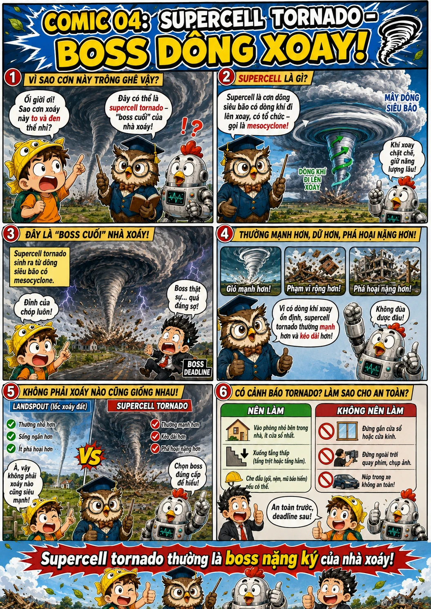
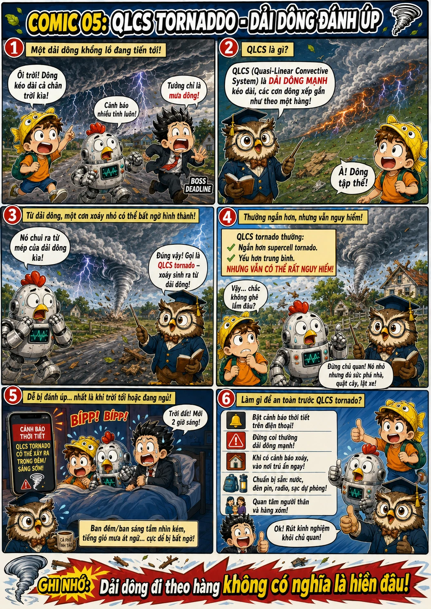
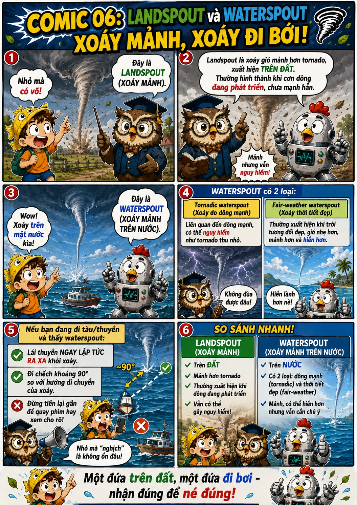
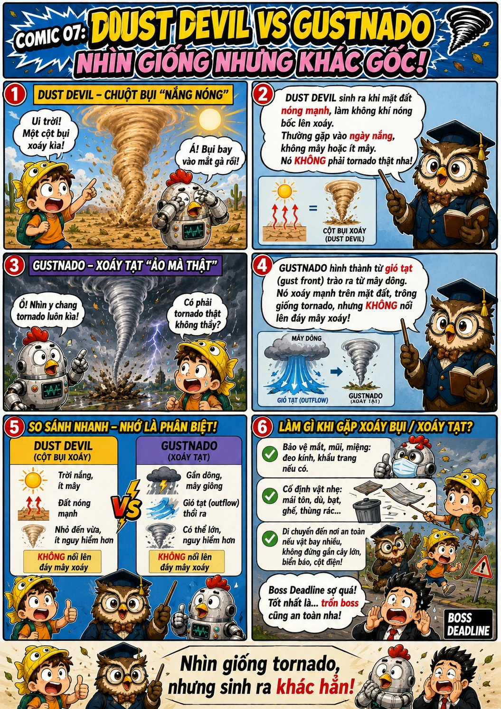
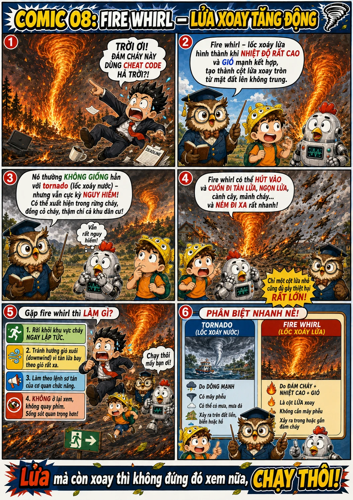
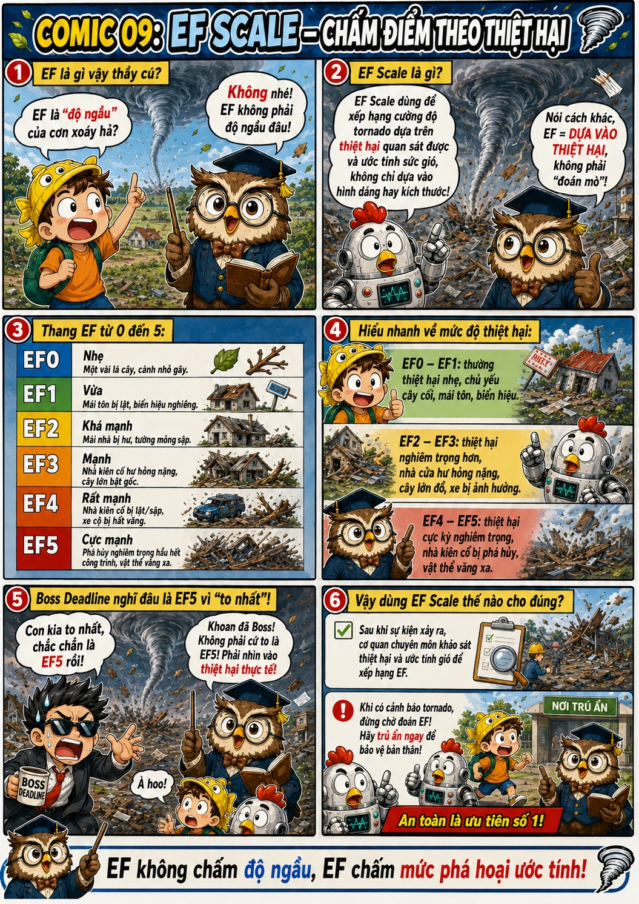
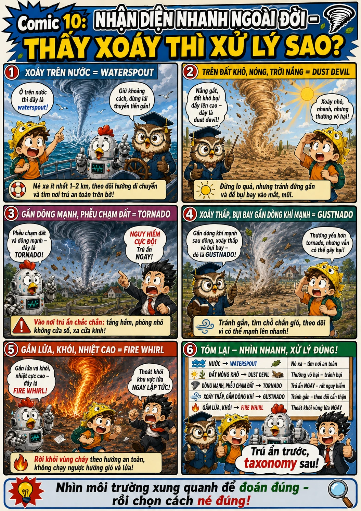

# Các loại lốc xoáy 🌪️

Nguồn: [NOAA NSSL - Tornado Basics](https://www.nssl.noaa.gov/education/svrwx101/tornadoes/), [NOAA NSSL - Tornado Types](https://www.nssl.noaa.gov/education/svrwx101/tornadoes/types/), [NWS - Waterspouts](https://www.weather.gov/mfl/waterspouts), [NWS - Dust Devils](https://www.weather.gov/fgz/DustDevil)

Nguồn: [NOAA NSSL - Tornado Basics](https://www.nssl.noaa.gov/education/svrwx101/tornadoes/), [NOAA NSSL - Tornado Types](https://www.nssl.noaa.gov/education/svrwx101/tornadoes/types/), [NWS - Enhanced Fujita Scale](https://www.weather.gov/oun/efscale)

Nguồn: [NOAA NSSL - Tornado Types](https://www.nssl.noaa.gov/education/svrwx101/tornadoes/types/), [NWS - Waterspouts](https://www.weather.gov/mfl/waterspouts), [NWS - Dust Devils](https://www.weather.gov/fgz/DustDevil), [NWS Glossary - Gustnado](https://forecast.weather.gov/glossary.php?word=gustnado), [Blue Whirls paper](https://arxiv.org/abs/1605.01315)

Nguồn: [NOAA NSSL - Tornado Basics](https://www.nssl.noaa.gov/education/svrwx101/tornadoes/), [NWS - Waterspouts](https://www.weather.gov/mfl/waterspouts), [NWS - Dust Devils](https://www.weather.gov/fgz/DustDevil), [NWS Glossary - Gustnado](https://forecast.weather.gov/glossary.php?word=gustnado)

Nguồn: [NOAA NSSL - Tornado Types: Supercell Tornadoes](https://www.nssl.noaa.gov/education/svrwx101/tornadoes/types/), [NOAA NSSL - Tornado Basics](https://www.nssl.noaa.gov/education/svrwx101/tornadoes/)

Nguồn: [NOAA NSSL - Tornado Types: QLCS Tornadoes](https://www.nssl.noaa.gov/education/svrwx101/tornadoes/types/)

Nguồn: [NOAA NSSL - Tornado Types: Landspouts and Waterspouts](https://www.nssl.noaa.gov/education/svrwx101/tornadoes/types/), [NWS - About Waterspouts](https://www.weather.gov/mfl/waterspouts)

Nguồn: [NWS - Dust Devils](https://www.weather.gov/fgz/DustDevil), [NWS Glossary - Gustnado](https://forecast.weather.gov/glossary.php?word=gustnado), [NOAA NSSL - Tornado Types](https://www.nssl.noaa.gov/education/svrwx101/tornadoes/types/)

Nguồn: [Blue Whirls paper](https://arxiv.org/abs/1605.01315), [NOAA NSSL - Tornado Basics](https://www.nssl.noaa.gov/education/svrwx101/tornadoes/)

Nguồn: [NWS - Enhanced Fujita Scale](https://www.weather.gov/oun/efscale), [NOAA NSSL - Tornado Basics](https://www.nssl.noaa.gov/education/svrwx101/tornadoes/)

Nguồn: [NOAA NSSL - Tornado Basics](https://www.nssl.noaa.gov/education/svrwx101/tornadoes/), [NWS - Waterspouts](https://www.weather.gov/mfl/waterspouts), [NWS - Dust Devils](https://www.weather.gov/fgz/DustDevil), [NWS Glossary - Gustnado](https://forecast.weather.gov/glossary.php?word=gustnado)

Nguồn: [NOAA NSSL - Tornado Basics](https://www.nssl.noaa.gov/education/svrwx101/tornadoes/), [NOAA NSSL - Tornado Types](https://www.nssl.noaa.gov/education/svrwx101/tornadoes/types/), [NWS - Waterspouts](https://www.weather.gov/mfl/waterspouts), [NWS - Dust Devils](https://www.weather.gov/fgz/DustDevil), [NWS Glossary - Gustnado](https://forecast.weather.gov/glossary.php?word=gustnado), [NWS - Enhanced Fujita Scale](https://www.weather.gov/oun/efscale), [Blue Whirls paper](https://arxiv.org/abs/1605.01315)
